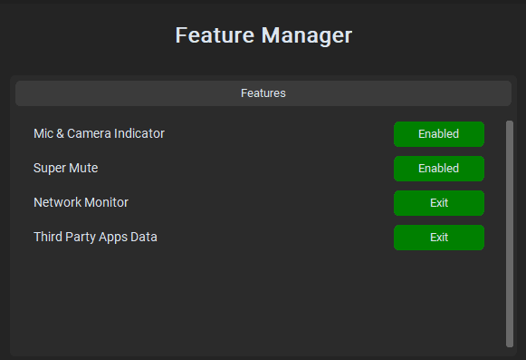
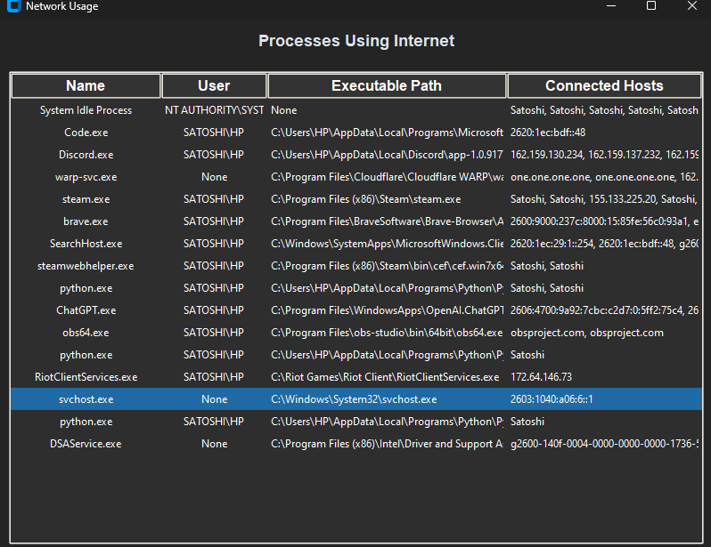
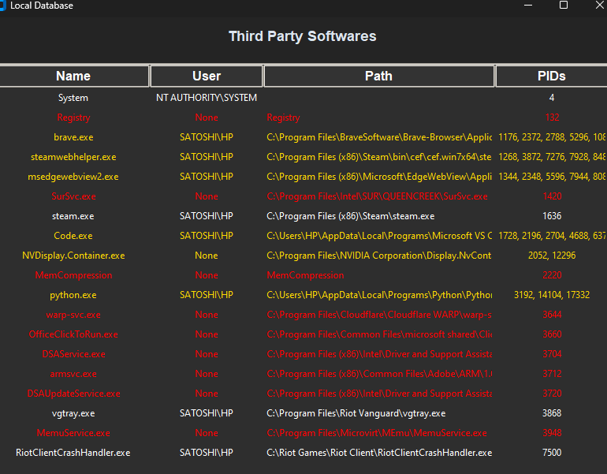
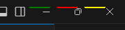
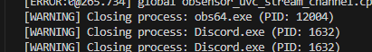

---
# SecretCodeLanguage

This is a secuirty Software to check hidden and abnormal behaviour of applications using features, it gives realtime complete information about softwares using internet, microphone, camera & apps running in background.

---

## **Screenshots**  
Below are some screenshots of the project in action:

### **1. Main Window**  
  

### **2. Network Usage Logs**  
  

### **3. Background Application Logs**  
  

### **4. Mic/Camera Indiator**  
  

### **5 Console Example of Software forcefully turning of discord and obs for using mic**  
  

---

### Prerequisites  
- Python 3.0
- Threadings  
- customtkinter
- tkinter 
- psutils
- comtype
- openCV
- socket

## **Contributing**  
Feel free to fork this repository, make your changes, and submit a pull request. Contributions are always welcome!

---

## **License**  
This project is licensed under the MIT License.

---

